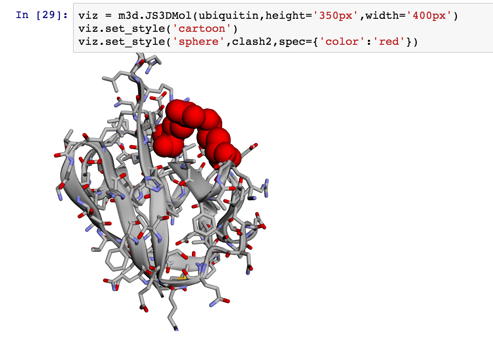

#Py3DMol

Py3DMol is a python package for flexible molecular visualization in iPython notebooks. Objects from MDAnalysis, MDTraj, OpenBabel, and CClib can be visualized and manipulated directly from the notebook. Structures are rendered in javascript/WebGL using the 3DMol.js library.



##About
This package started as hackathon project for the <a href="http://www.cecam.org/workshop-1214.html">CECAM 2015 Macromolecular Simulation Workshop.</a>

###Contributors
**Maintained by**:<br>
Aaron Virshup, _Bio/Nano Research Group, Autodesk Research_<br>


Kasia Ziolkowska, _Max Planck Institute_<br>
Tom Newport, _University of Oxford_<br>
Fiona Naughton,  _University of Oxford_<br>
Martin Vögele, _Max Planck Institute_

##Dependencies
This package is designed for the Jupyter Notebook platform and requires the ```ipython[notebook]``` and ```ipywidgets``` libraries.

This packages uses the 3DMol.js library as a backend for molecular visualization - a minified version is included here. See <a href="http://3dmol.csb.pitt.edu/doc/index.html">3DMol.js</a>
